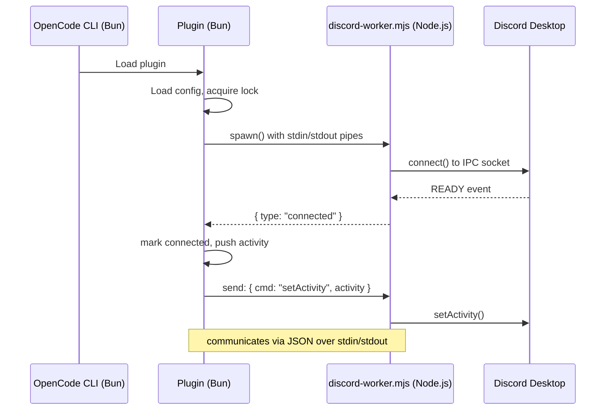
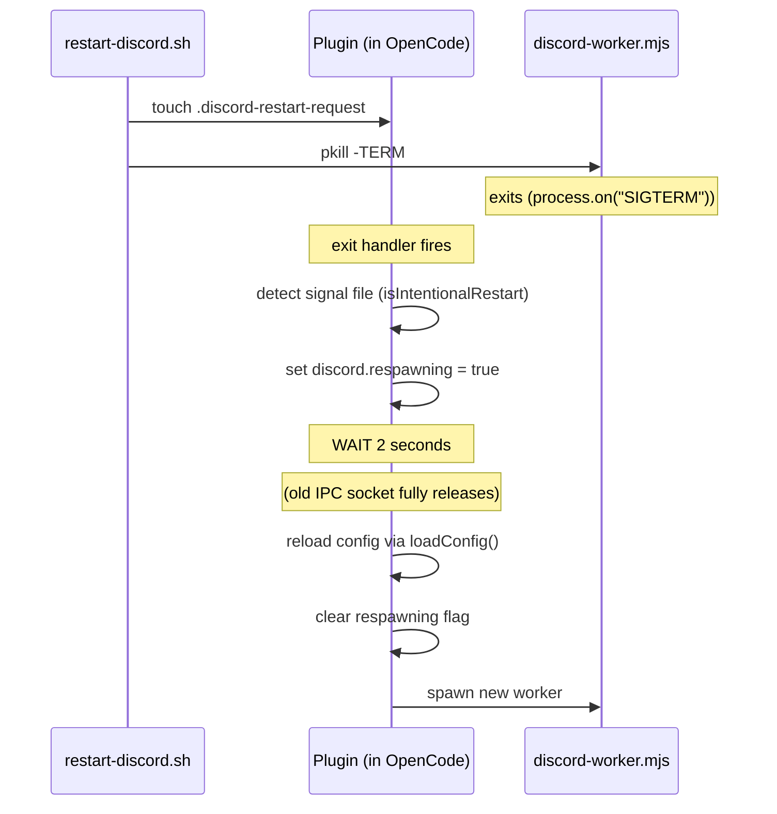
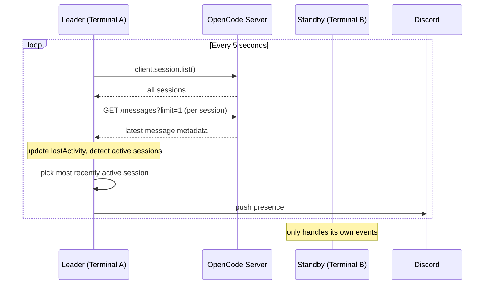
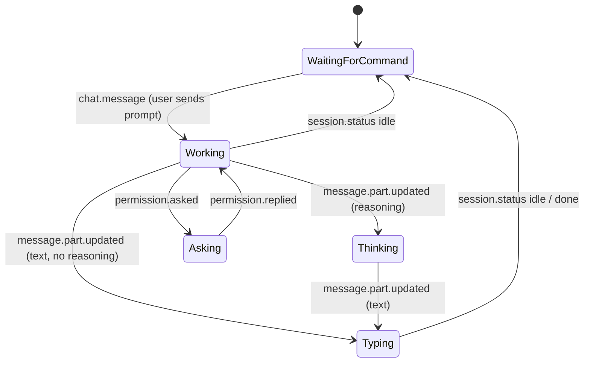

# Architecture

## High-Level Flow



## Why Subprocess Architecture?

OpenCode plugins run in **Bun runtime**. But:

- **Bun has known issues** with Unix domain sockets (Discord IPC)
- `net.createConnection()` fails with `ECONNREFUSED` in Bun
- Bun's native `Bun.connect()` works but the socket API differs

Solution: Run the Discord RPC client in a **Node.js subprocess** (full Unix socket support), communicate via stdin/stdout (JSON).

## Restart Mechanism (Signal File)

When `./restart-discord.sh` is run:



Without the 2-second delay, the new worker's connection races with the old worker's IPC socket cleanup, causing a brief disconnect/reconnect flicker.

Normal crash (no signal file): Plugin uses 3-second backoff before respawning.

## Multi-Instance Coordinator

Discord IPC allows only **ONE active connection per Application ID**.

```
Lock file: ~/.config/opencode/.opencode-dc-too-rich-presence.lock
Contents: {"pid": 12345, "started": 1234567890}
```

**Algorithm:**
1. Plugin init: try exclusive create lock file (`wx` flag)
2. If success -> this instance becomes **leader** (only one pushes to Discord)
3. If lock exists with fresh timestamp -> another instance is leader, become **standby**
4. Leader updates lock file timestamp every 5 seconds (heartbeat)
5. If lock is stale (>15s old) -> standby steals lock, becomes new leader

**Behavior:**
- Leader: pushes to Discord, sends presence updates, writes output file
- Standby: doesn't push to Discord, doesn't write to output file
- On leader death: standby takes over automatically after 15 seconds

## Global Activity Polling (Auto-Switch)

Each plugin instance only receives events for its own OpenCode process's sessions. So with 3 terminals, each instance is blind to events from the other 2.

The leader solves this by polling all sessions globally every 5 seconds:



Result: When user runs a prompt in Terminal B, the leader detects it in the next poll cycle and switches Discord display to show Terminal B.

## Config Resolution Order

**Single source of truth:** `~/.config/opencode/discord-config.json`

Both plugin and worker read from this file. Plugin passes the value to worker via `DISCORD_APP_ID` env var for convenience.

```
Priority 1: DISCORD_APP_ID env var          (per-session override)
Priority 2: ~/.config/opencode/discord-config.json   (single source)
Priority 3: developer App ID "1512803991300476989"    (fallback)
```

If not configured, the plugin logs a warning and uses the developer's App ID as fallback.

### Where to Edit App ID

Edit `~/.config/opencode/discord-config.json`:
```json
{
    "discordAppId": "YOUR_APP_ID_HERE",
    "discordLargeImageKey": "opencode-logo-too-rich-presence"
}
```

Plugin picks up changes after running `./restart-discord.sh` (no OpenCode restart needed).

## Session State Machine



5 states:
- **Working** -- right after user sends prompt, before AI responds
- **Thinking** -- AI is reasoning (chain of thought)
- **Typing** -- AI is generating response text
- **Asking** -- AI needs user permission
- **Waiting for command** -- idle, waiting for next prompt

## Context Token Calculation

Context percentage matches OpenCode UI:

```js
contextTokens = tokens.input + tokens.cache.read
contextPercent = (contextTokens / model.limit.context) * 100
```

Represents the **latest message's** input + cache.read tokens (what was sent to the model), NOT the cumulative sum across all messages.

Tracks the latest message using `time.completed` (or `time.created` for in-flight messages).

## Discord Activity Format

```js
{
    details: "minimax-m3 · build · 6 prompts · $0.0000",
    state: "Working · 7.3% ctx",
    largeImageKey: "opencode-logo-too-rich-presence",
    largeImageText: "OpenCode"
}
```

**Constraints:**
- `details` and `state` max 128 chars each (auto-truncated)
- `largeImageKey` must be uploaded to Discord Dev Portal
- No buttons (per user preference)
- All text customizable via template engine (see CUSTOMIZATION.md)

## Failure Modes & Recovery

| Failure | Behavior | Recovery |
|---|---|---|
| Discord IPC not reachable | Worker exits, plugin respawns w/ backoff | Check Discord is running |
| Discord rate limit (Server at capacity) | Worker retries with 60-300s backoff | Wait 15-30 minutes |
| Plugin crashes | OpenCode logs error, plugin disabled | Restart OpenCode |
| Worker spawn fails | Plugin logs error, no Discord presence | Check Node.js install |
| Asset key invalid | Discord shows fallback image | Upload asset in Dev Portal |
